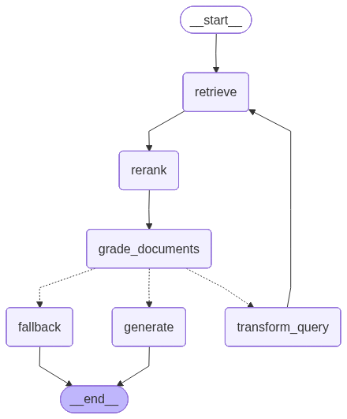

# Corrective RAG Chatbot

In this project I have build an advanced CRAG chatbot designed to answer queries from a medical Q&A dataset. Acting as a CRAG system, it leverages hybrid search(semantic + keyword), document re-ranking, and a stateful graph-driven workflow to deliver precise and contextually relevant responses.

The LLM is running locally in the system I'm not using any API.

## Tech Stack

- **Programming Language:** Python
- **Cuda Version:** 12.2
- **Core Libraries:**  
  - **LangChain:** A framework for developing applications powered by language models. It is used for document loading, text splitting, vector store management, and creating the overall RAG pipeline.  
  - **LangGraph:** A library for building stateful, multi-agent applications with LLMs.  
  - **Ollama:** An open source model Llama 3 8B model running locally for embeddings and text generation.  
  - **ChromaDB:** A vector store used to save and retrieve document embeddings.  
  - **BM25:** A keyword-based search algorithm used for retrieval.  
  - **FlashRank:** A library for re-ranking retrieved documents to improve relevance.  

- **Models:**  
  - **`llama3:8b`:** An open source model Llama 3 8B model running locally for embeddings and text generation. This language model is also used for generating answers and grading documents.  

## Setup & Install

To set up Ollama and pull the open-source Llama 3 (8B) model:

```bash
# Install Ollama
curl -fsSL https://ollama.com/install.sh | sh

# Pull the Llama 3 (8B) model
ollama pull llama3:8b

# Create conda env
conda create -n chat python=3.9
conda activate chat

# Install dependency
pip install -r requirements.txt
```

```bash
# Inference 
python main.py
```
## Architecture

The chatbot is built around a stateful graph (`StateGraph`) that manages the flow of data and operations. The main components of the architecture are:

1. **Document Loading and Processing:**  
   - A CSV loader reads the medical Q&A dataset.  
   - Documents are divided into smaller chunks to improve retrieval efficiency. 
   - An embedding cache is implemented so embeddings are computed only once. On subsequent runs, the system reuses the locally stored embeddings instead of recalculating them.

2. **Vector Store and Retrievers:**
   Applied embedding caching; first run generates and stores the embeddings locally, so that subsequent queries can use the cached database instead of recomputing them. First time it take around 25-30 mins to generate embeddings.
   - **ChromaDB:** Stores the document embeddings for efficient semantic search.  
   - **OllamaEmbeddings:** Used to generate embeddings for the documents and query.  
   - **Ensemble Retriever:** Combines both semantic (`vector_retriever`) and keyword-based (`bm25_retriever`) search to retrieve a diverse set of relevant documents.  

4. **Re-ranker:**  
   - **FlashRank:** A cross-encoder model that re-ranks the retrieved documents based on their relevance to the user's question.  

5. **Language Model (LLM):**  
   The Llama 3 8B open sourced model is used for two main purposes:  
     - Generating answers based on the retrieved context.  
     - Grading the relevance of the retrieved documents.  

6. **Graph State:**  
   - A `TypedDict` that represents the state of the graph, including the user's question, retrieved documents, generated answer, and the number of retries.  

7. **Graph Nodes:**  
   - Each node in the graph represents a specific function in the RAG pipeline, such as retrieving documents, re-ranking, generating an answer, grading documents, and transforming the query.  

## LangGraph Workflow




The program executes the following workflow, managed by the `StateGraph`:

1. **Retrieve:**  
   - The user's question is used to retrieve relevant documents from the vector store using the `EnsembleRetriever`.  

2. **Re-rank:**  
   - The retrieved documents are re-ranked by `FlashRank` to place the most relevant documents at the top.  

3. **Grade Documents:**  
   - The re-ranked documents are graded for relevance by the LLM. Documents that are not relevant to the question are filtered out.  

4. **Decide to Generate:**  
   - Based on the graded documents, the graph decides on the next step:  
     - If there are relevant documents, it proceeds to the `generate` step.  
     - If no relevant documents are found, the system reformulates the user’s query into an improved version and then proceeds to the `transform_query` step.  
     - If the query has already been transformed, it falls back to the LLM to generate an answer without RAG.  

5. **Generate:**  
   - The LLM generates an answer based on the relevant documents and the user's question.  

6. **Transform Query:**  
   - If the initial retrieval results are not relevant, the LLM transforms the user's query to be better optimized for retrieval, and the process starts again from the `retrieve` step.  

7. **Fallback:**  
   - If the RAG pipeline fails to find relevant documents even after a retry, the LLM generates an answer directly from the user's question without any context.

## Further Work

- Enhance response quality using advanced prompt engineering techniques such as *chain-of-thought reasoning* and *self-consistency*.  
- Improve model accuracy by performing full fine-tuning or applying parameter-efficient methods like *LoRA* on medical domain datasets.  
- Incorporate evaluation metrics such as *Recall* and *BLEU* to systematically assess and validate output quality.  
- Explore hyperparameter optimization, including experimenting with different *chunk-splitting strategies*, *re-rankers*, to improve retrieval and overall system performance.

